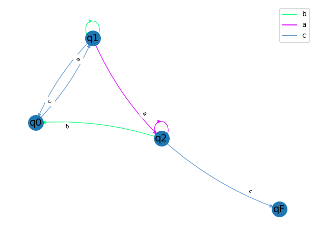

#### README file
### Laboratory work nr. 1

In order to verify how Finite Automaton works, it is needed user input, therefore the list of
some possible inputs for Variant 13 are presented as follows:
* Words that fit the grammar:
    * abbac
    * ababacaac
* Words that do not fit the grammar:
  * baacb
  * aaabc
  * abbab
  * ababac
  
The example of the graph obtained as output for Variant 13 is presented below.
